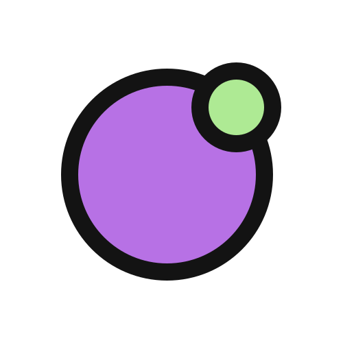

  

# CafunTalk

CafunTalk é um aplicativo de chat moderno, sem distrações e privado, sem historicos.

## 🚀 Funcionalidades

- ✅ Criação de salas de bate-papo
- ✅ Mensagens em tempo real
- ✅ Interface responsiva e amigável
- ✅ Imagens (Através de links)
- ✅ Bloco de Codigo
- ✅ Avatar Aleatorio

## 🛠️ Tecnologias Utilizadas

- **Frontend:** React
- **Backend:** Node.js, Express
- **WebSocket:** Socket.IO

## 💡 Passos Futuros

- Mudar origem das imagens, por enquanto estou pegando URL da net
- Melhorar componetização
- Criar sistema de convites
- Melhorar interface
  - Tela de **seleção** e **criação** de salas mais amigavéis ao invés de utilizar o URL para isso.
- Adicionar suporte a transcrição de voz
